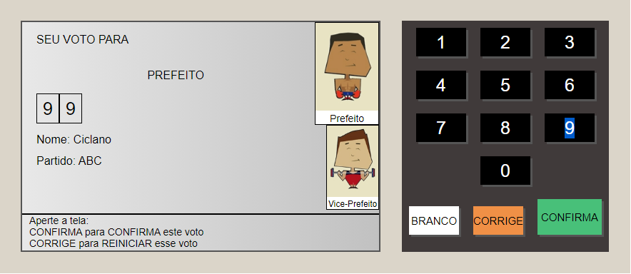

# 💻  Sobre o Projeto:
Este é um projeto desenvolvido durante o módulo de Java script do curso oferecido pela B7web, com o objetivo de evoluir a construção individual do aluno. Foram desenvolvidos 3 Projetos sendo eles uma Urna Eletrônica, um Slideshow e um Validador de Formulários,e nas páginas foram utilizandas apenas as tecnologias HTML5,CSS3 e Java Script.
 
# 🛠 Tecnologias utilizadas:

    <ul>
        <li>HTML</li>
        <li>CSS</li>
        <li>JavaScript</li>
    </ul>

# ⚙️ Funcionalidades:
## Validador de Formulários:
  <li>O usuário pode fazer um formulário que será validado pela página</li>

## Urna Eletrônica:

<li>O usuário pode fazer uma votação na urna para Vereadores(77222 ou 38111) e para prefeitos(99 ou 84). Além disso, pode ser feito votos em branco ou votar nulo </li>

## Slideshow:
<li>O usuário tem acesso a um slideshow com 3 imagens ,que de forma automática ou manual mudam entre elas em sequênciada</li>

# 🎨 Pré-visualização :
## Validador de Formulários

## Slideshow

## Urna Eletrônica

